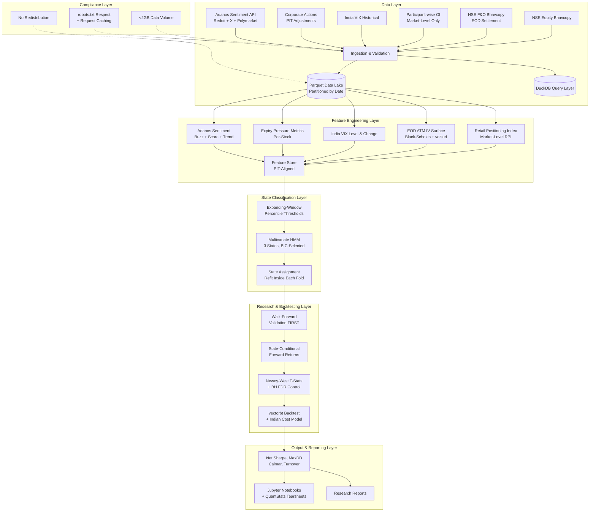

🏗️ System Architecture: Options Microstructure Research Platform (Corrected)

A modular, batch-oriented quantitative research engine implementing a state-machine regime framework with strict Point-in-Time (PIT) discipline, corrected for real-world Indian market data constraints.



---

🧩 Layer-by-Layer Breakdown

1. Data Layer (Open Sources, Compliance-Aware)

Built on freely available NSE data plus one optional alternative data source. All ingestion respects NSE's robots.txt and applies request caching.

NSE Equity Bhavcopy

· Use nsefin (lightweight, returns pandas DataFrames directly) or jugaad-data (mature, actively maintained, built-in caching, CLI support).
· Contains OHLCV, delivery percentage, and trade counts for all listed equities.
· Unadjusted for corporate actions — see Corporate Actions below.

NSE F&O Bhavcopy (EOD Settlement)

· This is the primary historical options data source.
· Contains settlement prices, volume, open interest, and contract metadata for all F&O contracts.
· Does not contain IV or Greeks — these must be computed.
· Historical intraday option chains do not exist for free. This is the hard constraint that reshapes the IV layer.

Participant-wise OI (Market-Level Only)

· Use nsefin to fetch FII / DII / Pro / Client breakdown across Index Futures, Index Options, Stock Futures, Stock Options.
· Critical correction: This is aggregate market-level data, published EOD only. It is not a per-stock positioning signal.
· Client category serves as a market-level retail proxy for NIFTY regime conditioning.
· Category totals mix directional bets with hedges and arbitrage — treat as sentiment overlay, not precise flow.

India VIX Historical

· Freely available from NSE, daily observations going back to ~2008–2012.
· Used as a direct feature (level and change), not as a term structure proxy.
· There is no liquid India VIX futures market — do not attempt to build a term structure from it.

Corporate Actions (PIT Adjustments)

· Required to avoid false price jumps in returns. Fetch via nsefin or NSE's corporate actions endpoint.
· Apply split/bonus/dividend adjustments as of the ex-date, not retroactively across the full history.

Alternative Sentiment — Adanos API

· Replaces Twitter/X scraping (now paid) and Reddit scraping (API limits).
· Provides Reddit (50+ subreddits), X/Twitter, and Polymarket prediction market sentiment.
· Outputs: Buzz Score (0–100), sentiment score (−1.0 to +1.0), mentions, trend, bullish/bearish split.
· Uses VADER + RoBERTa ONNX ensemble, not keyword counting.
· Free tier exists (reportedly ~250 requests/month) — verify current limits before committing.
· Optional OpenBB integration available via openbb-adanos.
· Treat as experimental, not a core pillar.

Compliance Constraints

· SEBI circular (Dec 20, 2024) sets an aggregate 2GB volume threshold for research-oriented NSE data access.
· Access is intended for accredited academic institutions, recognized research organizations, and think tanks. NSE may require an NDA.
· Do not redistribute raw data. Keep ingestion volumes under 2GB.
· Use nsefast (robots.txt-compliant, no login/captcha bypass) or jugaad-data (built-in caching).

---

2. Feature Engineering Layer

Transforms raw data into PIT-correct signals. Every feature is computed only from information available at the timestamp it is assigned to.

Retail Positioning Index (RPI) — Market-Level

· Constructed from Client category net Futures-Equivalent OI.
· NSE already delta-adjusts FutEq OI, so no additional normalization is needed on that axis.
· Normalize by total market OI: RPI = Client_Net_FutEq_OI / Total_Market_OI.
· Scope: NIFTY/market regime feature. Do not attempt to use as a per-stock cross-sectional signal.

EOD ATM IV Surface

· Compute IV from F&O bhavcopy settlement prices using Black-Scholes.
· Extract ATM IV at fixed tenors (7D, 30D, 60D) from near-month and next-month contracts.
· Use volsurf for SVI calibration and cubic spline interpolation across strikes.
· Reference implementation: IndexVol (ingests NSE settlement data, produces smiles, 3D surfaces, Greeks, risk regimes with market replay).
· Caveat: EOD IV from settlement prices is noisier than intraday IV, especially for illiquid strikes. Filter by minimum volume/OI before surface fitting.

India VIX Level & Change

· Direct feature: VIX level (z-scored via expanding window) and 1-day / 5-day change.
· Robust, widely used, freely available — a much better volatility regime input than a synthetic term structure.

Expiry Pressure Metrics (Per-Stock)

· For each F&O stock: OI in expiring contract / average daily cash volume.
· Captures physical settlement pressure in the week(s) leading into expiry.
· This is your per-stock signal, replacing the mis-scoped per-stock RPI idea.

Adanos Sentiment Features

· Buzz Score, sentiment score, mention count, trend direction.
· Aggregated to NIFTY-level and top F&O constituents.
· Must be PIT-aligned — record the timestamp of each API pull.

Feature Store

· All features stored PIT-aligned in Parquet, queryable via DuckDB.
· Each row tagged with as_of_timestamp (when the data was available) and event_timestamp (what period it describes).

---

3. State Classification Layer

The corrected core logic: a single multivariate regime model, not a Cartesian product of per-feature states.

Expanding-Window Percentile Thresholds

· Use pandas.expanding().quantile() — thresholds computed only from past data.
· Methodologically mandatory to avoid look-ahead bias.

Multivariate HMM (Not Per-Feature HMMs)

· Fit a single Gaussian HMM (via hmmlearn) on 2–3 features simultaneously.
· Recommended feature set: returns, realized volatility, India VIX change.
· Recommended state count: start with 2, test 3 and 4, select via BIC/AIC.
· 3 states is typically the sweet spot for interpretability and statistical robustness on ~1,250 daily observations.
· Typical state interpretations: calm/ranging, trending, stressed/high-vol.
· Use Viterbi in log-space for numerical stability. Track state probabilities and confidence.
· Alternative: Gaussian Mixture Model via scikit-learn if you want regime clustering without temporal transition dynamics.

Why not the original 2×2×2 design:

· Per-feature HMMs assume independence between features, which is false (vol and VIX are highly correlated).
· The Cartesian product creates empty and incoherent states.
· A joint model captures cross-feature covariance structure.

Walk-Forward Discipline

· The HMM is refit inside each walk-forward fold — never fitted on full history and then applied.
· Check state occupancy per fold (no state should have <5% of observations).
· Check transition matrix stability across folds.

---

4. Research & Backtesting Layer

The corrected pipeline order: walk-forward first, then analysis, then significance, then backtest.

Step 1 — Walk-Forward Validation

· Generate out-of-sample state labels.
· Expanding window: train on [0, t], predict on [t+1, t+k], roll forward.
· Typical config: 2-year initial train, 3-month OOS blocks, 5-year total history.

Step 2 — State-Conditional Forward Returns

· For each OOS state, compute forward returns (1d, 5d, 10d) for NIFTY and F&O stocks.
· Report mean, median, std, hit rate, and sample size per state.

Step 3 — Significance Testing

· Newey-West adjusted t-statistics (HAC standard errors for autocorrelated returns).
· Benjamini-Hochberg FDR control for multiple testing across states × horizons × instruments.
· Report effect sizes and confidence intervals, not just p-values.

Step 4 — Backtest Engine

· Use vectorbt (vectorized, 100–1,000× faster than Backtrader for parameter sweeps, free open-source tier sufficient).
· Indian cost model:
  · STT: 0.025% sell side (delivery), 0.1% both sides (intraday)
  · Exchange transaction: NSE 0.00297%, BSE 0.00375%
  · SEBI turnover fee, stamp duty, GST on brokerage + transaction charges
  · Brokerage: flat Rs 20/order assumption
  · Slippage: model separately (1–5 bps depending on liquidity)
· Do not model tax in the primary backtest. Report pre-tax, net-of-transaction-costs metrics. If tax modeling is required, state entity type and holding period assumptions explicitly.
· Reference: VectorBT Expert skill provides strategy templates, NIFTY 50 benchmarking, DuckDB loading, walk-forward analysis, QuantStats tearsheets, whole-share sizing.

---

5. Output & Reporting Layer

Performance Metrics

· Net Sharpe ratio (after transaction costs)
· Maximum drawdown
· Calmar ratio
· Turnover and cost drag
· State-conditional hit rates

Jupyter Notebooks

· EDA, state transition visualization, feature distributions
· Walk-forward fold diagnostics
· Research process documentation

Research Reports

· Final summaries for brand channels
· Clearly separate in-sample vs out-of-sample results
· State assumptions about data limitations (EOD IV, market-level RPI, sentiment coverage)

---

6. Compliance Layer (New)

Constraint Implementation
Data volume < 2GB Monitor Parquet lake size; downsample if needed
No redistribution Raw data stays local; only derived features/reports published
robots.txt respect Use nsefast or jugaad-data with caching
NDA awareness Be prepared to execute if NSE requests
Rate limiting Cache aggressively; batch downloads off-peak

---

💻 Technology Stack (100% Open Source, Corrected)

Layer Component Technology / Library Source Change from Original
Data NSE Bhavcopy (Equity + F&O) nsefin + jugaad-data PyPI / GitHub Replaced nselib
Data Option Chain (EOD) nsefin + F&O bhavcopy PyPI Replaced indiaopt
Data Participant-wise OI nsefin PyPI Scope corrected to market-level
Data India VIX NSE historical endpoint NSE New
Data Corporate Actions nsefin / NSE endpoint PyPI / NSE New
Data Sentiment Adanos API (free tier) adanos.org Replaced Reddit/Twitter scraping
Data IV Surface volsurf + IndexVol reference GitHub Same lib, corrected pipeline
Compute Core Language Python 3.10+ — Same
Compute Data Manipulation pandas, numpy — Same
Compute Query Engine DuckDB duckdb.org New
State HMM hmmlearn (multivariate, 3 states) GitHub Corrected from per-feature
State GMM alternative scikit-learn — Same
Research Backtesting vectorbt vectorbt.dev Replaced oq-backtest
Research Cost Model Custom Indian cost model — New
Research Statistical Tests scipy.stats, statsmodels — Same
Research Tearsheets quantstats GitHub New
Visualization Charts Plotly, matplotlib, seaborn — Same
Environment Dependency Mgmt Poetry or conda — Same
Environment Version Control Git + DVC — Same
Environment Notebooks Jupyter Lab — Same
Compliance Ingestion nsefast (robots.txt-compliant) GitHub New

---

📁 Project Directory Structure

```text
options-microstructure-research/
│
├── data/
│   ├── raw/                      # Raw bhavcopy, participant OI, VIX, corp actions
│   ├── interim/                  # Cleaned, validated, unadjusted
│   └── processed/                # PIT-aligned feature sets (Parquet)
│
├── src/
│   ├── data_ingestion/
│   │   ├── nse_bhavcopy.py       # Equity + F&O bhavcopy downloader
│   │   ├── participant_oi.py     # Market-level participant OI
│   │   ├── india_vix.py          # VIX historical fetch
│   │   ├── corporate_actions.py  # PIT adjustment tables
│   │   ├── adanos_sentiment.py   # Optional sentiment ingestion
│   │   └── validators.py         # Schema + PIT correctness checks
│   │
│   ├── feature_engineering/
│   │   ├── rpi.py                # Market-level Retail Positioning Index
│   │   ├── iv_surface.py         # EOD ATM IV via Black-Scholes + volsurf
│   │   ├── vix_features.py       # VIX level, change, z-score
│   │   ├── expiry_pressure.py    # Per-stock expiry pressure
│   │   ├── sentiment_features.py # Adanos aggregation
│   │   └── feature_store.py      # PIT-aligned storage
│   │
│   ├── state_machine/
│   │   ├── hmm_model.py          # Multivariate HMM, BIC selection
│   │   ├── thresholds.py         # Expanding-window percentiles
│   │   └── diagnostics.py        # Occupancy, transition stability
│   │
│   ├── backtesting/
│   │   ├── walk_forward.py       # OOS state generation
│   │   ├── state_returns.py      # Conditional forward returns
│   │   ├── significance.py       # Newey-West + BH FDR
│   │   ├── cost_model.py         # Indian transaction costs
│   │   └── engine.py             # vectorbt wrapper
│   │
│   ├── research/
│   │   ├── eda.py
│   │   └── reports.py
│   │
│   └── utils/
│       ├── config.py
│       ├── logging.py
│       └── compliance.py         # 2GB monitor, cache manager
│
├── notebooks/                    # EDA, diagnostics, research
├── reports/                      # Generated reports and figures
├── tests/                        # Unit + integration tests
├── config.yaml                   # Data paths, thresholds, model params
├── pyproject.toml                # Poetry dependencies
└── README.md
```

---

🚀 Next Concrete Step

Phase 1: Data Foundation (Weeks 1–2)

1. Set up Poetry environment with nsefin, jugaad-data, duckdb, pandas, numpy, pyarrow.
2. Download 5 years of:
   · Equity bhavcopy
   · F&O bhavcopy (EOD settlement)
   · Participant-wise OI (market-level)
   · India VIX history
   · Corporate actions table
3. Store in Parquet, partitioned by date. Load into DuckDB for querying.
4. Validate:
   · PIT correctness (no future data in any row)
   · Corporate action adjustments applied on ex-date, not retroactively
   · Total data volume under 2GB (compliance)
   · Schema consistency across the 5-year window
5. Gate: Do not proceed to Phase 2 until data validation passes. If volume exceeds 2GB, downsample or restrict the universe before continuing.

Once raw data is in place and validated, build the market-level RPI feature and verify PIT correctness. This is the foundation for everything else.

---

⚠️ Verify Before Building

A few items in this corrected plan are based on libraries and APIs whose details change over time. Confirm before committing:

· nsefin / jugaad-data / nsefast — check current maintenance status, GitHub activity, and whether they still work with the latest NSE website structure (NSE has changed its site before, breaking older libraries).
· Adanos free tier — verify the current request limit and pricing; the ~250/month figure may have changed.
· volsurf — confirm SVI calibration is production-ready for sparse Indian option chains; you may need to filter aggressively or fall back to simpler interpolation.
· vectorbt — confirm the free open-source version covers your walk-forward and cost-modeling needs, or budget for the Pro tier.
